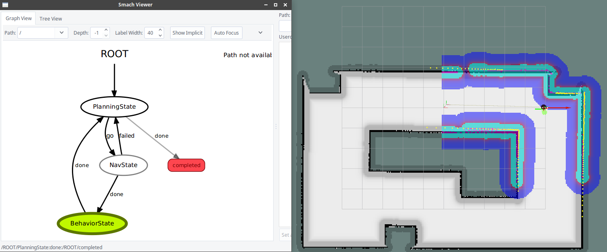

# my_fsm

Using smach to write a finite-state-machine to control move_base for navigation.

## Launch

```bash
roslaunch my_fsm main.launch
```

Start FSM by calling service

```bash
rosservice call /fsm/start {}
```


